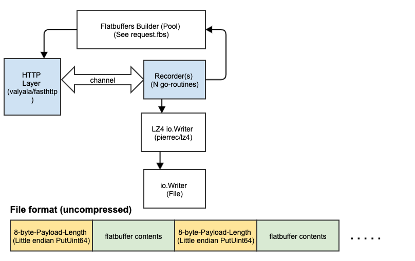

# blackhole

### Introduction
 * Backhole is an HTTP sink, to be used for testing & protoyping. Good for testing your outgoing http senders (proxies, http forwarders etc)
   - Pretends to be your real HTTP API/server
   - Consumes everything thrown at it (any path, any "host")
   - Reponds with a 200 and empty body
   - No pre-canned reponse yet
    
 * Record & Replay
 
    - `blackhole` lets you record and `replay` will replay, aka send the traffic to yet another site. 
   See next section for instructions on `replay`
   
 ### Usage
 
`$ blackhole`

Starts a service to receive, and acknowledge with 200-OK, all http requests to `:80` on any interface.
Default port, tsl (https) settings can be configured via a yaml config file.
It should be named `bhconfig.yaml`. Place in current working directory or under `$HOME/.blackhole`

```
$ cat bhconfig_sample.yaml
serve:
  - "http://:80"
tls:
  cert: /path/to/certs/www.foobar.com.pem
  privkey: /path/to/certs/www.foobar.com.pem
```

Data, payload of your request, is still ignored and dropped on the floor

When data is not saved, blackhole is nothing but a tiny wrapper around the excellent http library `fasthttp` 

`$ blackhole -o /path/to/save/files/ -c`

Requests will be saved in a compressed format.
Many files will be created depending on the nunber of threads
This *recording* and subsequent *replay* is the main 
additional value provided on top of fasthttp

# replay

`$ replay -H host.domain.com:8080 -q /tmp/requests/requests_*.lz4`

Send all data to a different destination.

NOTE: without `-q`, all communication back and forth is printed to stdout.
This will be very verbose.

blackhole - benchmarks
======

Please note that **all benchmarks assume connection reuse**.
Without connection reuse performance will be horrible in any server solution.

I use wrk to generate traffic as shown below

`wrk -t12 -c200 -s post-random.lua -d1m http://target.domain.com:8080/index.html`

* Test 1: **Server & Client**: Both running on a Macbook Pro
  * 110,000+ request/sec accepted, read, and then discarded. Run with `--skip-stats`. Request *counting* has a slight overhead, but that is the only thing on top of vanilla fast-http hello-world at this point.
  * 100,000 request/sec saved to disk (each with a 2k payload). Roughly 13 GB on disk for 6 million requests sent during a 1 minute test. Almost no overhead for disk i/o. `wrk` and other things running on the Mac is taking up some of the CPU, leaving only 4 cores for the app in either case.
  * Data payload is made random to trigger the pathological case for compression.
  * 95,000 req/sec with 4:1 compression ratio with LZ4 compression is enabled. Ratio depends on payload, but at least the body is made random in this test. Now disk size for 6 million requests is only about 2.8 G. [LZ4](https://github.com/lz4/lz4) is truly awesome and give us excellent compression without slowing us down.

* Test 2: **Server**: One L8s vm on Azure-US-West, **Client:** One DS2 v3 in Azure-US-East as client
  * 6,000 to 7,000 request/sec average with
     * 400 concurrent connections
     * A random payload of 2,000 characters.
     * Data payload is made random to trigger the pathological case for compression.
     * Server uses only 10% cpu resources. We could accomodate more clients.
     
* Test 3: **Server**: One L8s vm on Azure-US-West and **Client:** One L4s in Aure-US-West (same subnet)
  * 138,000 to 140,000 requests/sec average with same payload example as above.
  * Server uses 60% cpu resources.
  
* Test 4: **Server & Client**: One L8s vm on Azure-US-West (same host)
  * 260,000 requests/sec average with same payload example as above.
  * Server uses 95% cpu resources.
 
 ### Go specific benchmarks
Second column is iteration 
``` 
 BenchmarkBHSave-8     	  521817	     19763 ns/op	    2752 B/op	      36 allocs/op
 BenchmarkBHNoSave-8   	  683246	     17491 ns/op	    2701 B/op	      34 allocs/op
 ```

INSTALLING
======

* Steps
  * Download and Install Go from https://golang.org/dl/
  * Option 1 : run `go install ./...` from the cloned directory.
  Please note the three ellipses `...`, not two, a directory reference.
  By default, binaries will be installed in `${HOME}/go/bin`, unless you have
  either `${GOPATH}` or `${GOBIN}` set in which case binaries
  go to those directories.
  * Option 2: run `make`. `make` will build to the current directory / project root.
  If you don't usually develop applications in Go, this is probably the easiest method.
  
* To build for another machine (different architecture/os)
  * Run `./build-all-archs.sh` (builds for Windows, Linux, as well as MacOS) 

Design
=======


Code Documentation (For contributors)
=======
This is a binary package, not a library, but some of the components are still written as reusable libraries and the
documentation is available here. Internal APIs may not stable and would change. Please import with caution.

[github.com/adobe/blackhole/lib/archive/file](https://pkg.go.dev/github.com/adobe/blackhole/lib/archive/file)

[github.com/adobe/blackhole/lib/archive/request](https://pkg.go.dev/github.com/adobe/blackhole/lib/archive/request)

[github.com/adobe/blackhole/lib/fbr](https://pkg.go.dev/github.com/adobe/blackhole/lib/fbr)

[github.com/adobe/blackhole/lib/sender](https://pkg.go.dev/github.com/adobe/blackhole/lib/sender)

[github.com/adobe/blackhole/lib/slicehacks](https://pkg.go.dev/github.com/adobe/blackhole/lib/slicehacks)

